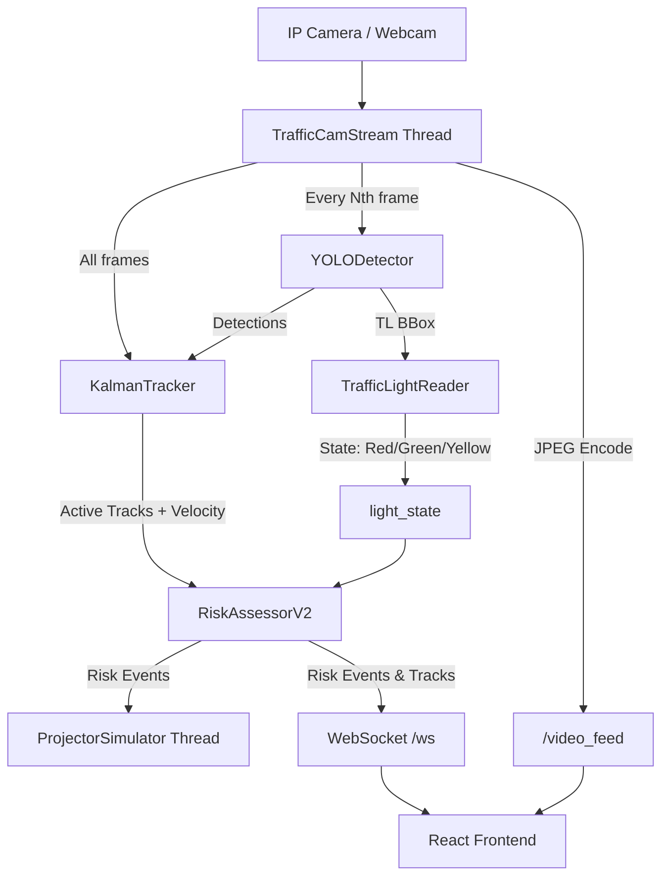

# CrossLight — From Camera to Caution in Milliseconds

> **Status: Active Prototype** — Built and tested on a single IP camera at a campus intersection. Not production-ready; expect rough edges and strict environmental dependencies.

---

## What This Is

CrossLight is a real-time intersection safety monitor designed to act *before* an accident happens. Instead of passively recording red-light runners for ticketing, CrossLight takes a live IP camera feed, analyzes vehicle trajectories, and triggers an immediate physical warning (via a projector simulator) when an intrusion is imminent.

The core premise is to bridge the gap between computer vision and physical infrastructure. By projecting a visible barrier directly onto the asphalt, pedestrians receive an unmistakable, heads-up warning without needing to look away from the road.

**Core Capabilities:**
- **Live Trajectory Tracking:** Uses YOLOv8 for detection and a Kalman filter for frame-to-frame tracking in real-world metre space.
- **Risk Assessment:** Employs ray-casting and homography to predict if a vehicle will enter a defined danger zone within the next second.
- **Projector Simulation:** Renders a dynamic, pulsing red barrier in a dedicated window, mapped back to the camera's perspective, demonstrating how a physical projector would behave.
- **Web Dashboard:** A React frontend connects via WebSockets to display live metrics, the video feed, and instant risk alerts.

---

## Table of Contents
1. [Why I Built This (The Honest Post-Mortem)](#why-i-built-this-the-honest-post-mortem)
2. [System Architecture & Data Flow](#system-architecture--data-flow)
3. [Deep Dive: Core Modules](#deep-dive-core-modules)
4. [Project Structure](#project-structure)
5. [Installation & Setup](#installation--setup)
6. [Calibration Guide (Crucial)](#calibration-guide-crucial)
7. [Performance Profiling](#performance-profiling)
8. [Test Suite](#test-suite)
9. [Known Limitations](#known-limitations)
10. [Roadmap](#roadmap)
11. [License](#license)

---

## Why I Built This (The Honest Post-Mortem)

I live near a chaotic intersection. Watching near-misses on my commute made me wonder: what would it take to build a system that could catch a red-light violation as it happens and physically warn a pedestrian crossing? Not a simulation, not a paper — an actual pipeline that runs on commodity hardware.

The projector idea came from a frustration with modern dashboards: alerts on a screen inside a control room don't help the person crossing the road. A projected barrier on the asphalt does.

**What Actually Broke During Development:**
- **The HSV Traffic-Light Classifier is Fragile:** It is genuinely hard to get right. Sunlight washing out the light housing, shadows from overhead cables, and the camera auto-adjusting exposure all break naive colour thresholds. I tuned it for the controlled conditions I had; it would need a deep learning approach for real Indian roads.
- **Kalman Tracking & Occlusion:** Occlusion handling is messier than textbooks suggest. When two vehicles overlap, the Hungarian assignment sometimes swaps IDs, causing the speed estimate to spike briefly. I mitigated this with an appearance histogram re-ID term, but it isn't a complete solve.
- **Homography Instability:** Getting the homography calibration to be stable was the hardest 20% of the project. The projector simulator only works if the homography is precise; even a 5-pixel error in the calibration clicks shifts the barrier by half a metre in the real world.

**What I'd Do Differently Next Time:**
- Use YOLO's native classification for traffic lights instead of the HSV approach.
- Integrate a robust re-ID module (e.g., OsNet) rather than relying on basic HSV histograms.
- Move the vision pipeline to C++ or use TensorRT for YOLO to claw back precious milliseconds.

---

## System Architecture & Data Flow

CrossLight is split into a Python backend (doing the heavy lifting) and a React frontend (for visualization). The backend runs asynchronously using `aiohttp`, managing the vision loop in the background while serving HTTP and WebSocket requests.


*(Note: The `/video_feed` endpoint streams MJPEG frames directly to the React frontend to avoid WebSocket binary payload overhead).*

---

## Deep Dive: Core Modules

### 1. Object Detection (`yolo_detector.py`)
Wraps the `ultralytics` YOLOv8n model. To maintain a usable frame rate on CPUs, detection is skipped for `N` frames (configurable via `--detection_skip_n`). The Kalman filter bridges the gap during skip frames. It filters out low-confidence detections and non-relevant classes.

### 2. Kalman Tracking (`kalman_tracker.py`)
The heart of the tracking system. It uses a **Constant-Acceleration Model** with a state vector `[x, y, vx, vy, ax, ay]`.
Crucially, tracking happens in **metre space**, not pixel space. Incoming pixel centroids are projected using the inverse homography matrix before the Kalman update. This ensures speed estimates (`speed_kmh`) are physically accurate regardless of camera perspective distortion.
- **Association:** Hungarian algorithm based on a cost matrix of `0.7 × IoU + 0.3 × HSV Histogram Distance`.

### 3. Risk Assessment (`risk_assessor.py`)
`RiskAssessorV2` evaluates if a tracked vehicle poses a threat.
- It projects the vehicle's current velocity vector 1 second into the future.
- It uses ray-casting (`point_in_danger_zone`) to check if this future trajectory intersects the user-defined polygon danger zone.
- If the traffic light is RED or YELLOW, and an intersection is found, an event is fired.
- It calculates the precise pixel coordinates for the barrier by back-projecting a point 1.5 metres ahead of the vehicle's bumper.

### 4. Traffic-Light Classification (`traffic_light_reader.py`)
*(See limitations section)*. Extracts a circular Region of Interest (ROI) from the YOLO-detected traffic light bounding box. It applies HSV thresholds to identify glowing bulbs. To handle noise, it requires the dominant colour to occupy at least 15% of the ROI and uses a majority-vote system across all detected lights in the frame.

### 5. Projector Simulator (`projector_simulator.py`)
A separate Pygame window running in a daemon thread. It consumes risk events from a thread-safe queue and draws pulsing, semi-transparent polygons at the calculated barrier positions. This decouples the rendering logic from the main vision loop.

---

## Project Structure

```text
CrossLight/
├── crosslight-frontend/       # React/Vite Dashboard
│   ├── src/components/        # UI Components (ControlRoom, CameraFeed)
│   └── package.json
├── tests/                     # Pytest Unit Test Suite
│   ├── test_kalman_tracker.py
│   ├── test_risk_assessor.py
│   └── test_traffic_light_reader.py
├── benchmark.py               # Granular pipeline stage profiler
├── calibration.py             # Interactive tool for homography & danger zones
├── danger_zone.py             # Ray-casting geometry helpers
├── detector.py                # Wrapper export for YOLODetector
├── kalman_tracker.py          # Primary Constant-Acceleration Tracker
├── kalman_tracker_v2.py       # Experimental Constant-Velocity Tracker
├── main.py                    # Primary Entry Point (Asyncio Web Server)
├── main_v2.py                 # Legacy Entry Point (No Web Server)
├── projector_simulator.py     # Pygame overlay engine
├── risk_assessor.py           # V1 (Rect) and V2 (Polygon) Risk Logic
├── traffic_camera.py          # Threaded MJPEG stream consumer
├── traffic_light_reader.py    # HSV-based TL classifier
└── yolo_detector.py           # Ultralytics inference wrapper
```

---

## Installation & Setup

**Prerequisites:** Python ≥ 3.11, Node.js ≥ 20 LTS, a network-reachable camera (MJPEG or H.264 stream). Tested on Windows 11.

```bash
# 1. Clone the repository
git clone <your-repo-url>
cd CrossLight

# 2. Create and activate a virtual environment
python -m venv venv
# Windows:
venv\Scripts\activate
# Linux/Mac:
source venv/bin/activate

# 3. Install Python dependencies
pip install -r requirements.txt

# 4. Install frontend dependencies
cd crosslight-frontend
npm install
cd ..
```

---

## Running the System

You must run the backend and frontend in separate terminals.

**Terminal 1 — Backend:**
```bash
# Using an IP Camera (e.g., IP Webcam app on Android)
python main.py --stream_url http://192.168.1.X:8080/video

# Using a local USB webcam
python main.py --stream_url 0
```

**Terminal 2 — Frontend:**
```bash
cd crosslight-frontend
npm run dev
# The dashboard will be available at http://localhost:5173
```

**Useful Backend Flags:**
- `--no_calibration`: Run without `.npy` files; uses a fallback rectangle zone.
- `--simulated_light`: Uses a timer-based traffic light instead of the fragile HSV detection (Highly recommended for demos).
- `--detection_skip_n 3`: Run YOLO every 3rd frame (default).
- `--port 5000`: Change the backend API port.

---

## Calibration Guide (Crucial)

If you do not calibrate the system, tracking speeds will be wildly inaccurate and the projector simulator will draw barriers in the wrong places.

1. Place a known, perfectly rectangular object flat on the ground in the camera's view (e.g., a 2m x 1m mat, or clearly marked parking lines).
2. Run the calibration script:
   ```bash
   python calibration.py --stream_url http://<CAM_IP>:8080/video
   ```

**Phase 1: Homography Matrix (`calibration_matrix.npy`)**
- You will be asked to click the 4 corners of your rectangle.
- **CRITICAL:** You must click them in exactly this order: **Top-Left → Top-Right → Bottom-Right → Bottom-Left**.
- Enter the real-world width and height of the rectangle in metres when prompted.

**Phase 2: Danger Zone Polygon (`danger_zone.npy`)**
- Click multiple points to outline the area you want to protect (e.g., the crosswalk).
- Press `d` after each click to confirm the point.
- Press `f` when you are done to close the polygon and save.

---

## Performance Profiling

The system was profiled using the included `benchmark.py` script (CPU only, i7-12700H, no GPU). While an idealized lab benchmark suggests the pipeline could theoretically hit ~50+ FPS (by running YOLO at ~50ms every 3rd frame and fast skip-frames at ~4ms), **real-world performance is typically 4–8 FPS** over a WiFi camera stream.

This massive gap between theoretical and actual performance comes down to three genuine system bottlenecks:

1. **YOLO Inference is the Ceiling:** Running YOLOv8n at 1280×720 on CPU takes ~50ms per frame. Even with a `detection_skip_n=3`, this puts a hard limit on system responsiveness.
2. **Tracker Complexity Scales Non-Linearly:** Our benchmark showed Kalman tracking takes ~1.4ms for 6 active tracks. However, at a busy intersection with **48 active tracks**, the Hungarian matching algorithm's O(n³) complexity causes the tracking step to spike to **~61ms**. At that density, the tracker becomes as expensive as the neural net.
3. **Network/Async Contention:** The `asyncio` event loop running the WebSocket server competes with the vision pipeline for CPU time. Combined with unstable WiFi IP camera latency (often causing the capture thread to retry), this introduces significant jitter.

**Architectural Fixes Required for Production:**
- **Wired Connections:** The camera stream must be hardwired. WiFi latency destroys the frame buffer and causes cascading delays.
- **Resolution Downscaling:** Dropping YOLO input resolution from 1280×720 to 640×640 roughly halves inference time.
- **Process Isolation:** The vision pipeline and the web/websocket server need to be moved to separate processes (e.g., using `multiprocessing`) to prevent I/O blocking from tanking the vision frame rate.

---

## Test Suite

Tests live in `tests/` and use `pytest`. No camera or GPU needed — all tests use fast, synthetic numpy data.

```bash
pytest tests/ -v
```

| Component | Coverage Focus |
|-----------|---------------|
| `test_traffic_light_reader.py` | Color thresholding, majority-vote logic, handling of OOB bounding boxes and empty crops. |
| `test_kalman_tracker.py` | Track lifecycle (creation, persistence, deletion), ID stability, and speed estimation convergence. |
| `test_risk_assessor.py` | Both V1 (Rectangle) and V2 (Polygon) modes, verifying ray-casting intersection logic and pedestrian coupling. |

---

## Known Limitations

**1. The HSV Traffic-Light Classifier is Fragile**
This is the weakest component. It was tuned for the lighting conditions on one specific camera at one time of day. It will likely misclassify under:
- Direct sunlight washing out the housing.
- Camera auto-exposure adjusting mid-scene.
- Non-standard light colours (LED arrays with slightly different hues).
*Workaround: Use `--simulated_light` for reliable demonstrations.*

**2. Single-Camera, Single-Plane Assumption**
The homography maths assumes all tracked objects move on a perfectly flat ground plane. This breaks for hilly roads, ramps, or tall vehicles (like buses) where the bounding box center does not accurately reflect the vehicle's footprint on the road.

**3. No Re-ID Across Track Loss**
If a vehicle is occluded by a larger vehicle for more than `max_missed` frames (default: 10), it is deleted. When it reappears, it is assigned a new track ID.

---

## Roadmap

This is a prototype. The roadmap focuses on achievable stability improvements rather than feature bloat.

- [ ] **Model Upgrades:** Replace the fragile HSV classifier with YOLO-based traffic-light state classification from a fine-tuned model.
- [ ] **Better Association:** Add a proper DeepSORT-style re-ID module (e.g., OsNet) to handle severe occlusions without losing Track IDs.
- [ ] **Validation:** Test against recorded footage from a real, dense Mumbai intersection rather than a campus setup.
- [ ] **Deployment:** Dockerize the entire stack to eliminate environment setup issues and prepare for edge-device (Jetson Nano) testing.

---

## License

MIT License — Use it, break it, improve it.

*Built by Daksh — [dakshshrivastav56@gmail.com](mailto:dakshshrivastav56@gmail.com)*
